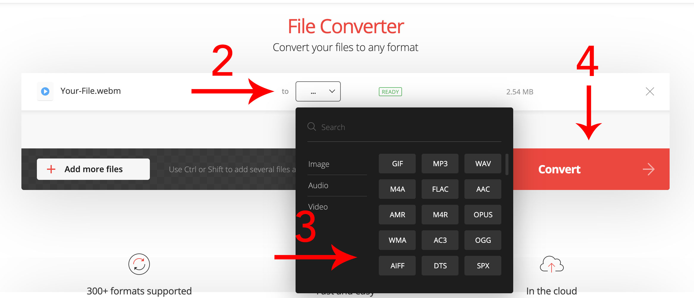
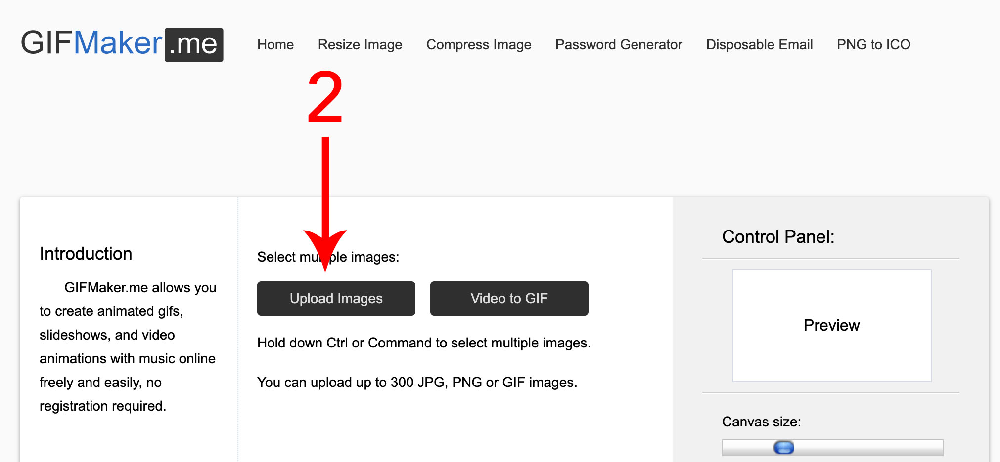
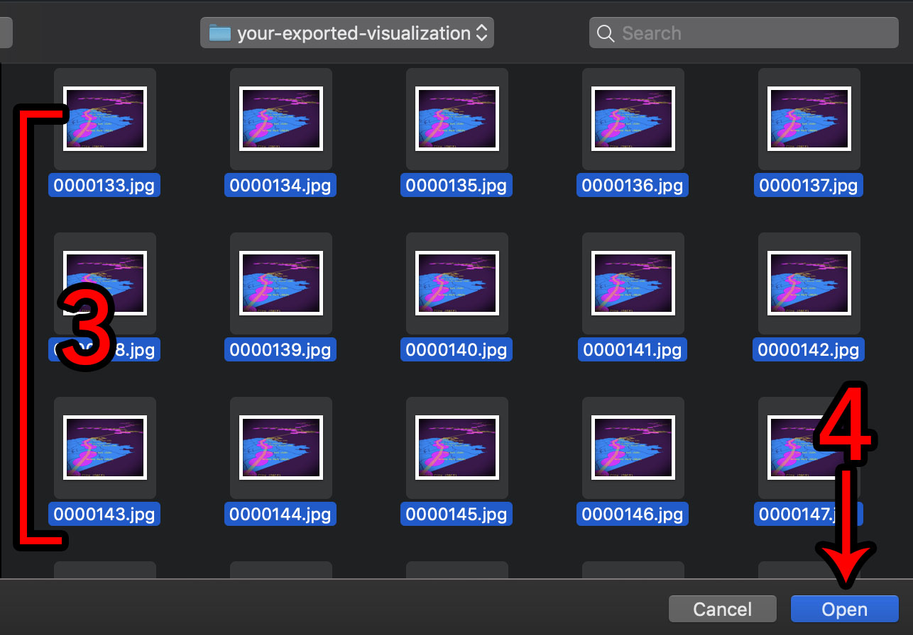
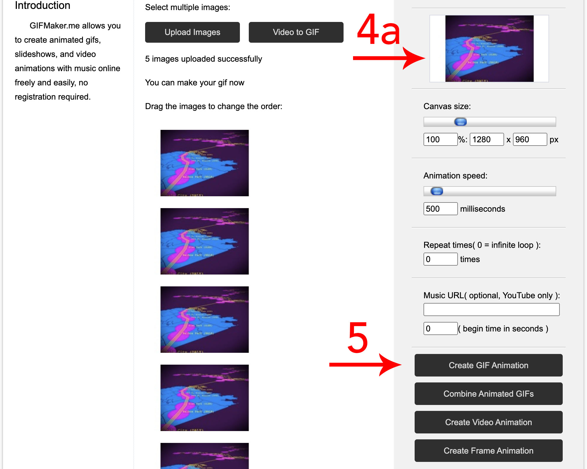
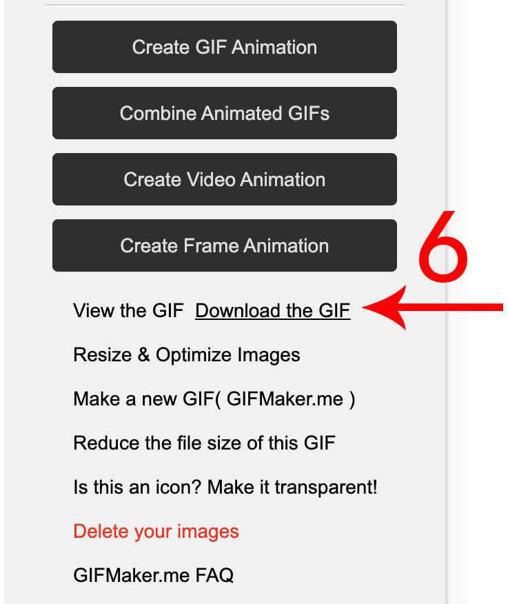

# Rendering Tips
Hubble offers the following options to render your visualizations:
- GIF & MP4
- WebM video
- PNG sequence
- JPEG sequence

If you would like to use the exports in a presentation we recommend the following steps:

### GIF & MP4
Usable as is. Feel free to add it to your presentation, notebook, or showcase!

### Convert WebM
There are plenty of free converters out there. The ones written in this guide will be based off of: https://convertio.co/

Step 1: Pick your WebM file

Step 2: Click the "..." option to open up a menu
Step 3: Select the filetype that you want. We recommend GIF/MP4 for use in your presentations
Step 4: Click Convert

### Convert JPEG sequence to mp4
There are plenty of free converters out there. The ones written in this guide will be based off of: https://gifmaker.me/

Step 1: Untar the file. On Windows a tool like [7-Zip](https://www.7-zip.org/) can be used
Step 2: Click on Upload Images

Step 3: Select all the images in the folder that was created
Step 4: Open all the images

Step 4a: A preview will be generated at the top. Settings such as order and pacing can be adjusted if anything looks wrong
Step 5: Click on "Create GIF Animation"

Step 6: Click on "Download the GIF"

### Convert PNG sequence to mp4
See "Convert JPEG sequence to mp4" section